#  SKYREME Auto Mechanic Workshop Web Project 

## 👤 Student Information
*   **Full Name:** Banele Brian Dlamini
*   **Student Number:** ST10512734
*   **Subject Name:** Web Development 
*   **Class Group:** 1

---

##  Project Overview
This project is a clean, front-end web platform built from scratch for SKYREME Auto Mechanic Workshop. Back in 2024, the business started as a mobile mechanic service run out of a single van, but it has since grown into a fully equipped physical workshop handling everything from routine servicing to complex computer diagnostics. 

Up until now, the garage only lived on an informal Facebook page. Trying to book car repairs through direct messages while working under vehicles was an absolute nightmare, and local drivers couldn't find the shop on Google. This website gives the workshop an official home, lists clear pricing models, and automates customer booking requests.

---

## Website Goals and Objectives
*   **Stop the DM Headache:** Move customer repair bookings away from messy social media messages into an automated system.
*   **Build Digital Trust:** Create an official web space to prove our mechanical credentials and show transparent pricing upfront.
*   **Improve Efficiency:** Cut down basic customer service phone queries regarding operating hours and branch locations by 20%.
*   **Targets for Success (KPIs):** We are aiming for 150 confirmed online bookings within the first three months of launch and a stable 5% visitor conversion rate.

---

##  Design and User Experience (UX)
The look and feel of the site completely matches our industrial, practical automotive workshop theme:
*   **Colour Scheme:** A dark Grey background, high-contrast White text, and bright Red interactive elements for high visibility on call-to-action choices.

*   **Typography:** Set entirely in the clean **Aptos** font family, using large, bold headers for an engineering feel and highly legible body layouts.

*   **Fixed Button Shortcut:** Features a floating red "Book Now" button anchored to the bottom edge of the screen, allowing users to schedule a service instantly from any page with a single click.

##  Website Structure & Sitemaps
The platform uses lightweight native code written inside **Visual Studio Code (VS Code)**, using standard semantic HTML and fully responsive CSS styles layout rules.

### Mobile Vertical Layout View (Default Stack Pattern)
On mobile devices, all items automatically adapt to a clean, single-column vertical layout to save data and prevent scrolling stress:
`Top Navigation Menu` ➔ `Fixed Booking Button` ➔ `Stacked Service Cards` ➔ `Contact Information`

### Desktop Horizontal View Layout
On large computer screens, the system overrides the stack rules to display advanced grids matching our wireframes:
```text
                          +------------------------+

                          |   HOMEPAGE NAVIGATION  |
                          |      (index.html)      |
                          +-----------+------------+
                                      |
       +------------------+-----------+-----------+------------------+

       |                  |                       |                  |
+------v-----+     +------v-----+          +------v-----+     +------v-----+

|  ABOUT US  |     |OUR SERVICES|          |MAKE ENQUIRY|     | CONTACT US |
| (about.html)     |(services.html)        |(enquiry.html)    |(contact.html)
|            |     | [ 4-Column ]          |            |     |            |
+------------+     +------------+          +------------+     +------------+
```
*   **Homepage Setup:** Split into a clean horizontal two-column display, placing workshop graphics directly beside the interactive booking block.
*   **Services Grid Setup:** Displays our core vehicle maintenance packages inside a balanced, multi-column desktop grid with parallel card heights.
---

## Changelog
*   **Changes in index page**
    * I added a short enquiry form to the right of the index page so that it matches my wireframe and that it can be visible to users what is required by the enquiry form.
    * I adjusted and added some pictures on the index page so that it displays as shown on the wireframe and so that users can   view our SKYREME Auto workshop.
    * I added our services on the bottom of the index page so that users can now what to expect on the services page.
    * I made the `book now` button to glow so that users can immediately make a booking.

    **Changes in services page**
    * I adjusted the picture sizes of all the services so that they display nicely in three-column and I removed the big picture that was displaying under the `our services` heading.
    * I added an `enquire a service` link and a `book now` button so that users can be directed to the enquiry form.
    * I also added a `heading 2` on the word `SERVICE PACKAGES` and some brief details of the packages. 

    **Changes in contact page**
    * I added `span class="contact-icon">&#128205;` location icon and a `span class="contact-icon">&#128222;` phone icon to make our website nice and clean. 
    * I also added a fake `Instagram`, `Facebook`, and `Tiktok` links and icons at the footer of the contact page, to show the business online presence within the social media platforms. 

*   **Changes to all pages**
    * I linked my css to all the pages so that I can apply styling to my website.

*   **Mobile layout screenshots:**
 ### Homepage Layout View
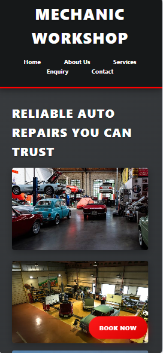

### About us page Layout View
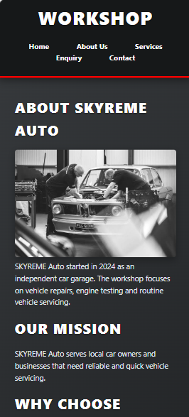

### Service page Layout View
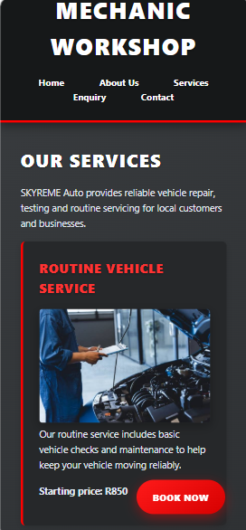

### Enquiry page Layout View
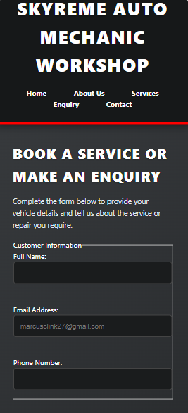

### Contact page Layout View
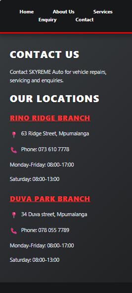

*   **Tablet layout screenshots:**
### Homepage Layout View
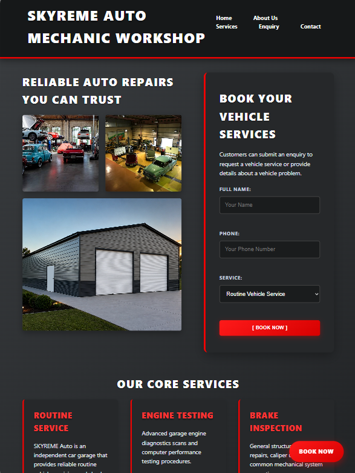

### About us page Layout View
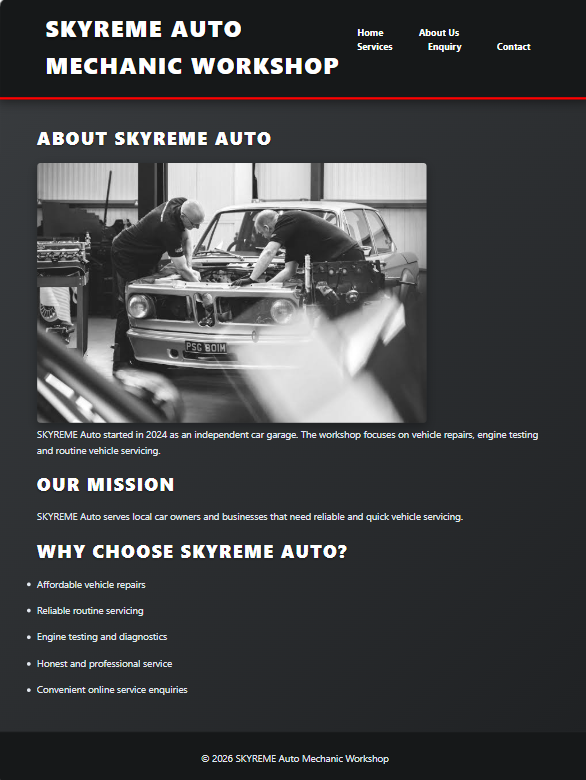

### Service page Layout View
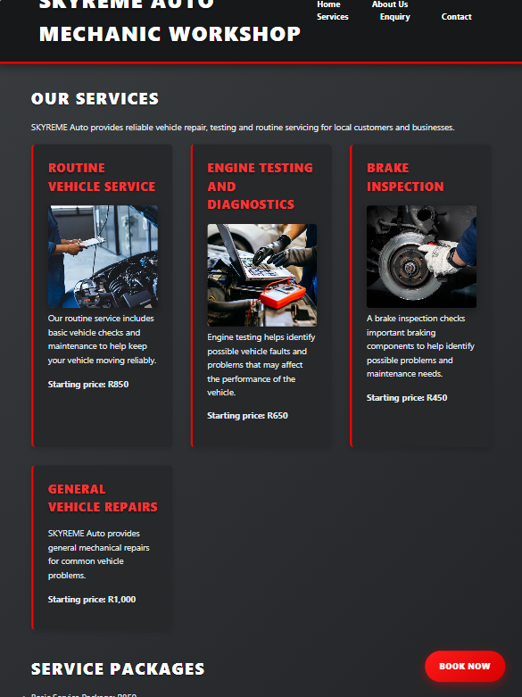

### Enquiry page Layout View
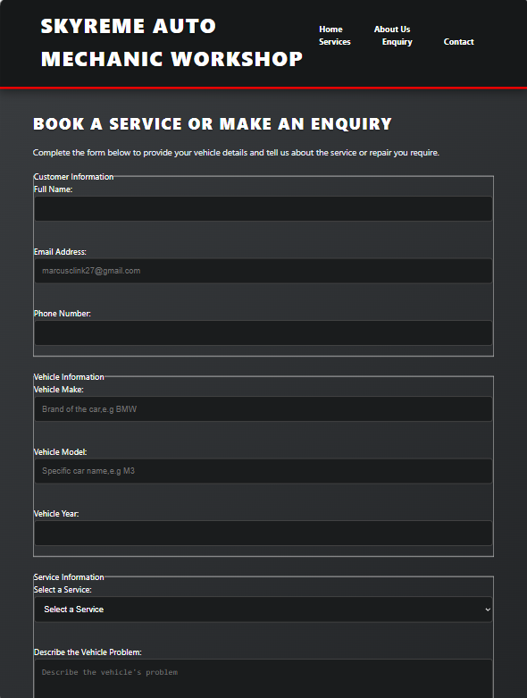

### Contact page Layout View
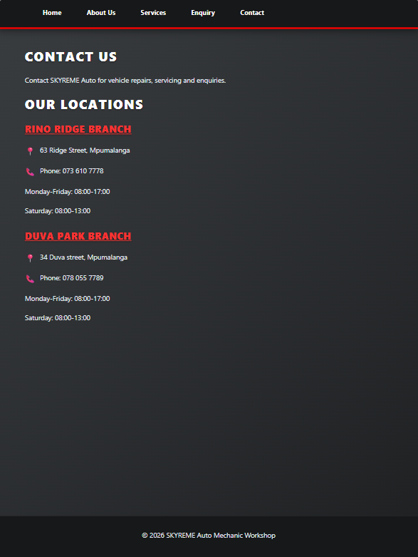

*   **Laptop and Desktop layout screenshots:**
### Homepage Layout View
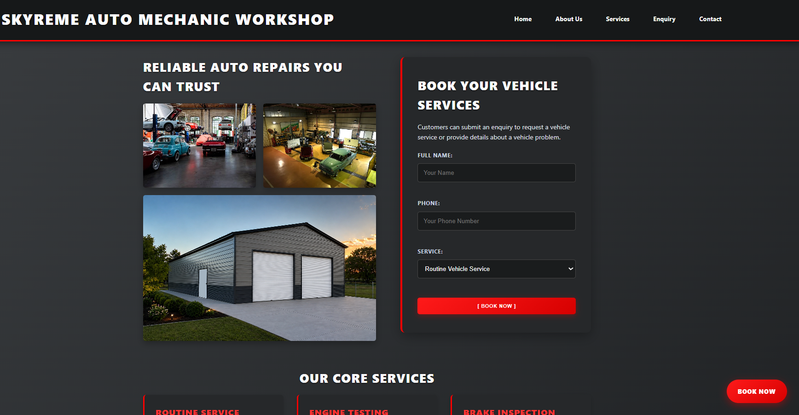

### About us page Layout View
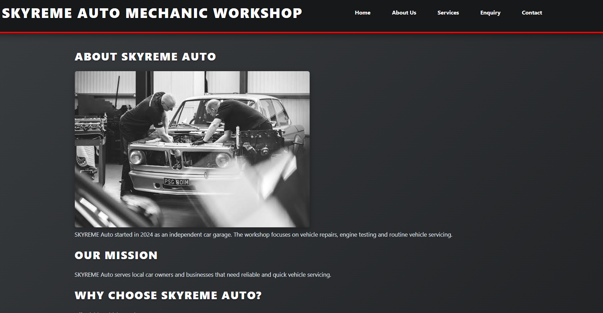

### Service page Layout View
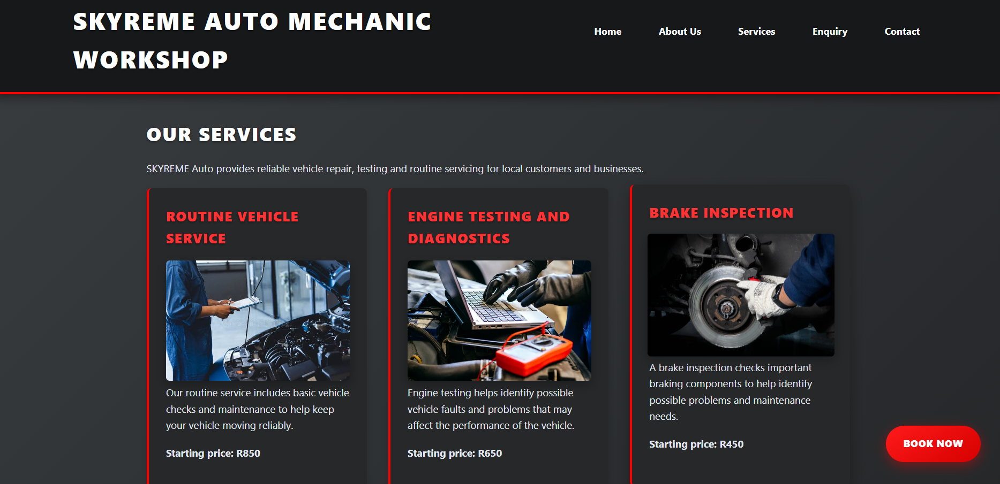

### Enquiry page Layout View
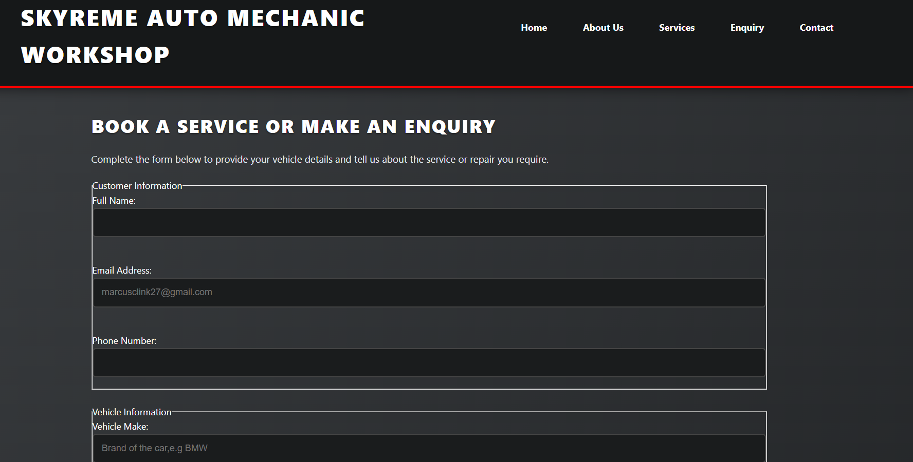

### Contact page Layout View
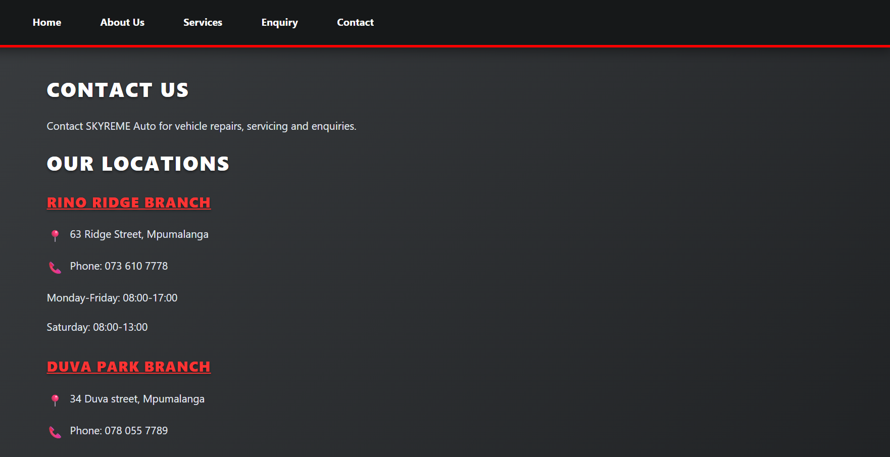
---

##  References
*   **Minnie, L.,** 2024. *How often should you service your car?*. Available at: https://autotrader.co.za [Accessed: 12 August 2026].
*   **Minnie, L.,** 2025. *Car service costs in South Africa: What to expect*. Available at: https://autotrader.co.za [Accessed: 25 July 2026].
*   **Writer, S.,** 2018. *Servicing your car to become much cheaper in South Africa*. Available at: https://mybroadband.co.za [Accessed: 25 July 2026].
*   **Powell, K.,** 2022. *Why I use grid over flexbox for this common layout*. [video online]. Available at: https://www.youtube.com/watch?v=ctHE8EXEoj8 [Accessed: 13 September 2026].
* **Powell, K.,** 2019. *Transitions, transition-delay and hover for "backward" animations*. [online video]. Available at: https://www.youtube.com/watch?v=pi3yYBg7nIQ [Accessed: 13 September 2026].